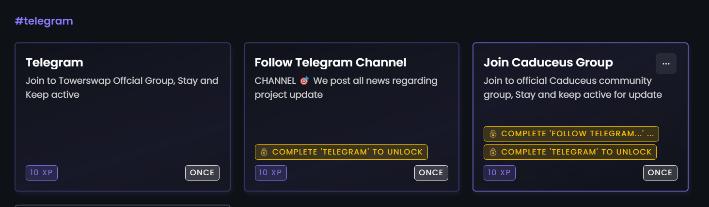

# Airdrop

<figure><figcaption></figcaption></figure>

## TowerSwap Testnet Airdrop

How to join Airdrop?

1. Go to [Airdrop Platform ](https://towerswap.crew3.xyz/)
2. Connect your wallet address.
3. Verify your wallet
4. &#x20;Create profile.
5. Enter to the task.

## Task.

### 1 Join Telegram  <mark style="color:blue;">(once task)</mark>

<figure><figcaption></figcaption></figure>

Complete the task by joining the requested telegram. You cannot continue the second task if the first task is not completed.

### 2. Follow Twitter  <mark style="color:blue;">(once task)</mark>

<figure><figcaption></figcaption></figure>

### 3. TESTNET TASK <mark style="color:blue;">(weekly task)</mark>

<figure><figcaption></figcaption></figure>

Complete all of this task to get testnet reward.&#x20;

Guide :&#x20;

1. <mark style="color:yellow;"></mark>[<mark style="color:yellow;">Swap</mark>. ](#user-content-fn-1)[^1]

_After you buy or sell tokens on the swap page. take the Txhash of the transaction you made and fill it into the first task._

Get TXhash here

<figure><figcaption></figcaption></figure>

&#x20;__ 2.  [<mark style="color:yellow;">Add Liquidity.</mark>](#user-content-fn-2)[^2]<mark style="color:yellow;"></mark>

&#x20;_After the addition of liquidity. take a screenshot and fill it into the second task._

Screenshot Example

<figure><figcaption></figcaption></figure>

&#x20;3\. <mark style="color:yellow;"></mark> [<mark style="color:yellow;">Farming</mark>](#user-content-fn-3)[^3]<mark style="color:yellow;"></mark>

_After you add liquidity. then use your LP token to get a reward on the farming page. Then take a screenshot and fill in the third task_

Screenshot example

<figure><figcaption></figcaption></figure>

### 4. Referral  <mark style="color:blue;">(daily task)</mark>

Invite your friend to join airdrop and get reward.&#x20;

<figure><figcaption></figcaption></figure>

### 5.  FeedBack  <mark style="color:blue;">(once task)</mark>

Give your feedback regarding our Dex paltform, Tell us about issue and anything you was found there.&#x20;

Fill your feedback here :&#x20;

<figure><figcaption></figcaption></figure>

To join <mark style="color:green;">**Testnet Airdrop,**</mark> <mark style="color:green;"></mark><mark style="color:green;"></mark> You will need CMP Testnet token.&#x20;

Claim testnet token here : [https://dev.caduceus.foundation/testNetwork/](https://dev.caduceus.foundation/testNetwork/)

## Reward&#x20;

<mark style="color:yellow;">**The reward ratio is 10 XP = 1 TW Mainnet.**</mark>

Reward will be distributed a week after the <mark style="color:blue;">**Tower token mainnet**</mark> is launched on Towerswap dex.

### Additional Explanation

1. <mark style="color:blue;">Once Task</mark>

Participants only have one chance to get a reward through this task.

&#x20; 2\. <mark style="color:blue;">weekly Task</mark>&#x20;

Participants can take part in this task every weeks for additional rewards.

[^1]: 

[^2]: 

[^3]: 
