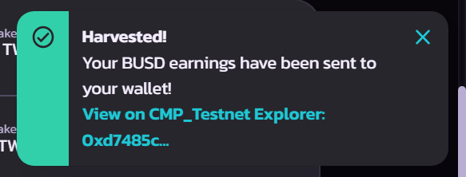

# How to harvest

Harvest your staking pools reward by following the guide below.

Go to [https://towerswap.finance/pools](https://towerswap.finance/pools)

Go to any live pools or finish pools to unstake or harvest your reward.

Click "Harvest" to harvest your reward.

<figure><figcaption></figcaption></figure>

Or click "<mark style="color:purple;">**-**</mark>" to unstake or "<mark style="color:purple;">**+**</mark>" to add more token.

when you click the "Harvest button, you will see the confirm popup&#x20;

<figure><figcaption></figcaption></figure>

Click "confirm" and approve in your wallet.

Then you will get notification after successful harvest.

<figure><figcaption></figcaption></figure>

Done. check the reward in your wallet :tada:
