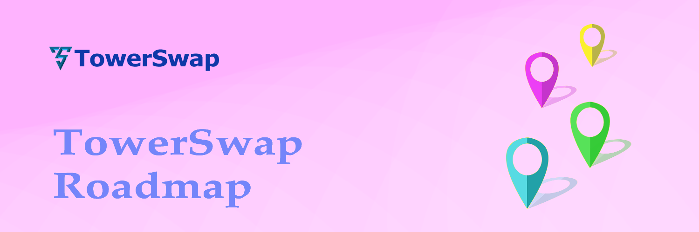

# Roadmap

<figure><figcaption></figcaption></figure>

### **2022**

* Caduceus blockchain identification
* Ideas and Concepts
* Website and whitepaper development
* Dex development and testnet integration
* Publish the project to the public
* Apply grant program
* Start the first Airdrop (Dex Testnet)

### Q1 2023

* Tower Token incubators launch
* Mainnet Launch
* Farming & Staking features launch
* Airdrop Distribution
* AMA section with Cadeceus and Towerswap community
* Start Partnership
* Platform Audit

### Q2 2023

* Tier1 TW token Exchange listing
* Launch NFT Marketplace
* Launch Caduceus Bridge
* Launch Caduceus LaunchPad

### Q3 2023

* Start adding other chains
* More Partnership
* More AirDrops

### Q4 2023

* Tier2 TW token Exchange listing
* Starting evaluation for year project, Platform upgrade and adding currency payment system

