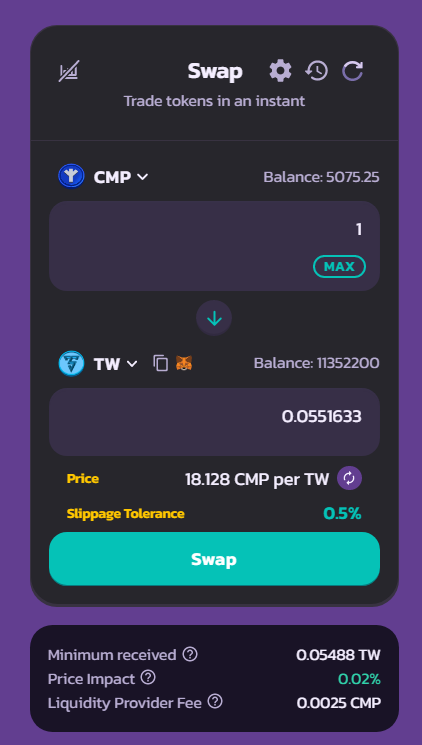
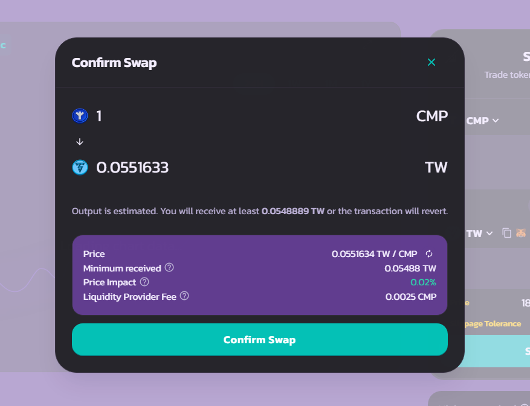
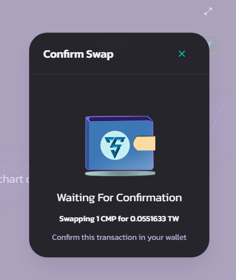

# How to trade

### Connect your wallet & Started

Go to the Exchange Page and click Unlock Wallet and make sure you're on the CMP Mainnet or Testnet network.&#x20;

<figure><figcaption></figcaption></figure>

Click on the dropdown menu in the "From" section to choose the token you want to trade, after ensuring it's one of the tokens you actually hold.

<figure><figcaption></figcaption></figure>

### Caption:

**CMP** : Tokens that are used to buy other tokens, you can use other tokens there, it doesn't have to be CMP.

**TW** : TW is TowerSwap token. The TW drawn is meant for the tokens to be purchased. it doesn't have to be TW, you can choose other tokens there like USDT or USDT and others.

**Slippage** : Slippage is used to set taxes on the exchange, the lowest tax is 0.5% but if you buy tokens that use high taxes. slippage will be increased depending on token requirements.

**Insufficient Liquidity** : This article will come out if you want to trade tokens that don't have liquidity yet. but for tokens that already have liquidity, they will display prices as well as taxes and whatever you want to know about purchases to make a decision whether you want to keep trading or not.

**Swap** : If you are sure of the choice of tokens you want to buy or sell, click **Swap** and confirm your wallet

<figure><figcaption></figcaption></figure>

Click **Confirm Swap** and your wallet will notice about transaction, then confirm your transaction on your wallet.

<figure><figcaption></figcaption></figure>

 

<figure><figcaption></figcaption></figure>

After confirming the wallet is complete, you will receive a notification like the following.

<figure><figcaption></figcaption></figure>

Add token to your wallet by clicking **Add**

<figure><figcaption></figcaption></figure>

**Done** :tada:

you have trade your token.&#x20;
