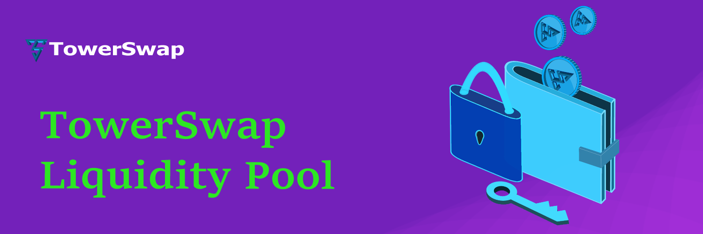

# 📦 Liquidity

<figure><figcaption></figcaption></figure>

## LP Tokens

If you deposit CMP and TW tokens you will receive CMP-TW LP tokens which will represent your portion of the CMP-TW Liquidity Pool.

The funds deposited will be redeemable at any time. All you need to do is remove your liquidity.

#### LP Token Details

`Name : TowerSwap LPs`

`Symbol : Tower-LP`

`Decimal : 18`

### Liquidity Providers earn trading fees

When traders use your liquidity pool, you earn a share of the fees.

If your pair is traded on TowerSwap, the trader pays a 0.25% fee, of which 0.17**%** is subsequently added to the respective Liquidity Pool.

For added gains, you can also farm your LP tokens for some sizzling yield on our Farms all while still earning your 0.17% trading fee.
