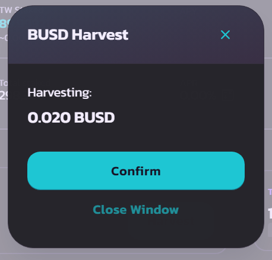

# Add liquidity

### Adding Liquidity

This is the initial screen when you open the liquidity page. Then click **+ Add Liquidity**.

After that you will be redirected to the following page.

<figure><figcaption></figcaption></figure>

Then, click **Select a currency**

<figure><figcaption></figcaption></figure>

Then, chose one token of that list, or paste your token address on columb.

<figure><figcaption></figcaption></figure>

After the token is added. you can click <mark style="color:green;">**supply**</mark> to deposit tokens. Or you will be asked to <mark style="color:yellow;">**approve**</mark> it first if the token you are adding liquidity has never had any liquidity at all.

<figure><figcaption></figcaption></figure>

After everything is finished. you will be directed to the following page. if you are sure to increase your liquidity, then click <mark style="background-color:green;">**Confirm Supply**</mark>.

<figure><figcaption></figcaption></figure>

This is LP token estimated you will received after adding liquidity.

After Confirm Supply, you will get notification on your wallet to confirm the transaction. click confirm and you will get notifiacaction like this.&#x20;

<figure><figcaption></figcaption></figure>

Add LP token to metamask by clicking **Add**

<figure><figcaption></figcaption></figure>

Then, LP token overview on your wallet.

<figure><figcaption></figcaption></figure>

After liquidity was added, you will see the following page.

<figure><figcaption></figcaption></figure>

### Done.&#x20;

Your liquidity was added.

<mark style="background-color:orange;">**Note :**</mark>&#x20;

_`Save your LP token and don't sent to anyone. LP token can be used to earn token reward by adding to Farming features.`_

_<mark style="background-color:green;"></mark>_
