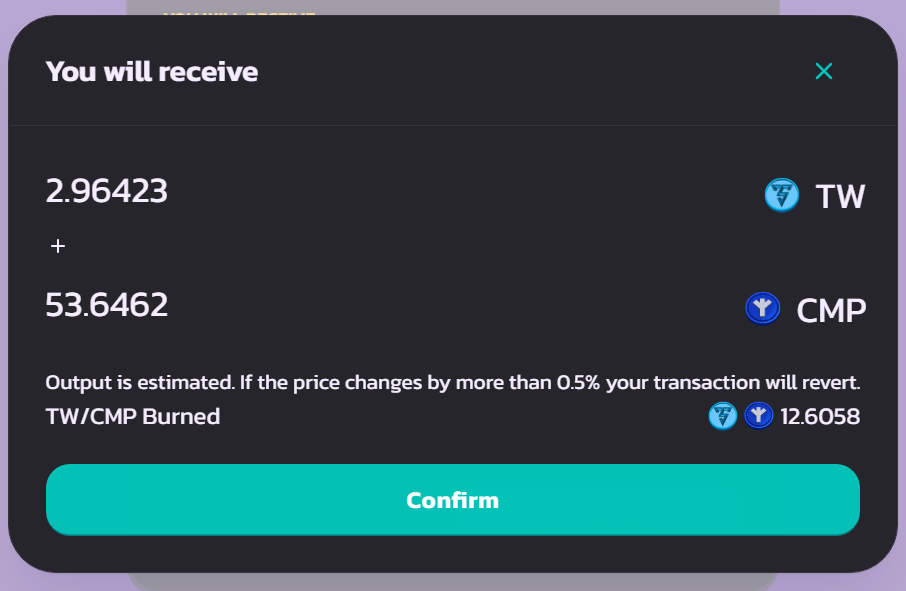
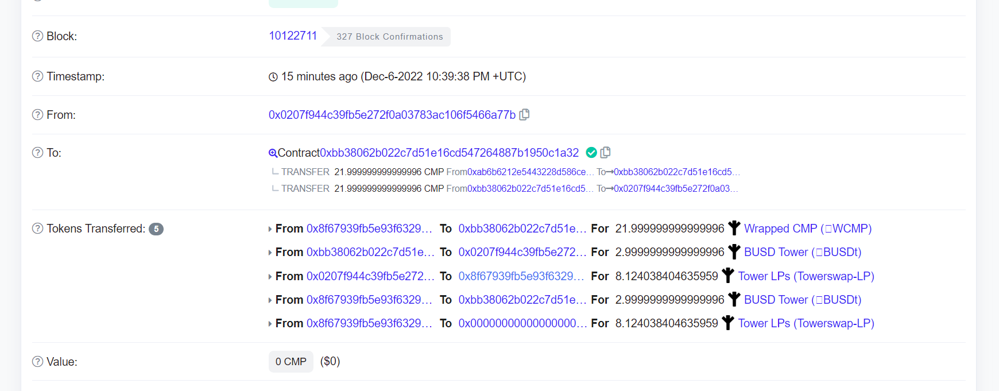

# Remove Liquidity

## Removing Liquidity

First, Click on your liquidity and you will this this example page. then klick <mark style="background-color:green;">**REMOVE.**</mark>

<figure><figcaption></figcaption></figure>

Then, you will bring to following page.

<figure><figcaption></figcaption></figure>

<figure><figcaption></figcaption></figure>

Then, click <mark style="color:green;">**Enable**</mark> if this is first time removed then confirm your wallet. and click <mark style="color:green;">**Remove**</mark> after enable done.&#x20;

<figure><figcaption></figcaption></figure>

Click <mark style="color:green;">**Confirm**</mark> and confirm your wallet.

**Done** :tada:

_`Your Token was added to your wallet and LP token was removed from your wallet.`_

<figure><figcaption>
This is proof that liquidity has been moved.
</figcaption></figure>

