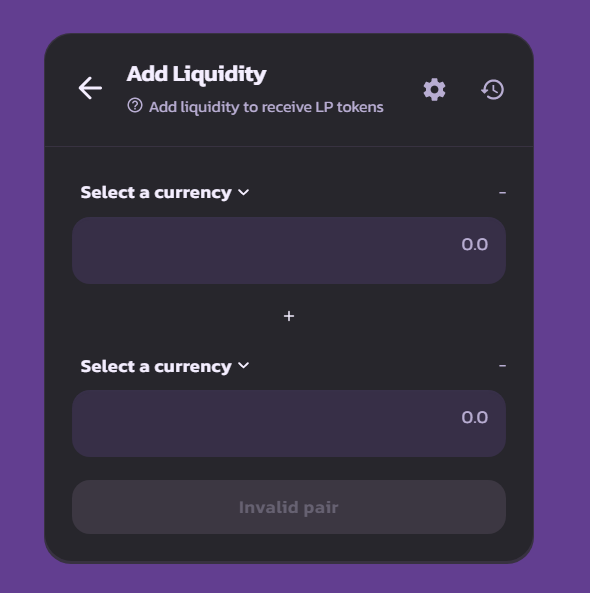
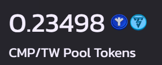

# How to stake

Go to [https://towerswap.finance/pools](https://towerswap.finance/pools)

Click pools details to open pools

<figure><figcaption></figcaption></figure>

Click Connet wallet

<figure><figcaption></figcaption></figure>

After your wallet was connected. you will see the "Stake" button.

<figure><figcaption></figcaption></figure>

Click "Stake" button and you will see the a popup to stake

<figure><figcaption></figcaption></figure>

Enter the amount of TW you want to stake then click confirm and approve in your wallet. After you give permission in your wallet. you will see the number of tokens and rewards you get in the stake and harvest column&#x20;

<figure><figcaption></figcaption></figure>

Done, the staking pool has been turned on. Let your token work for you and enjoy the results :tada:
