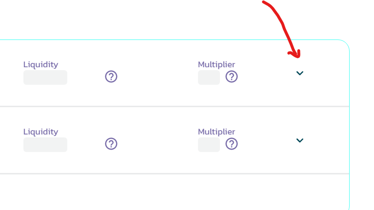
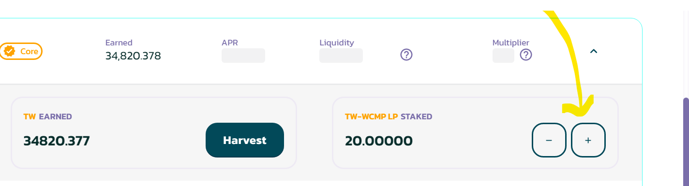
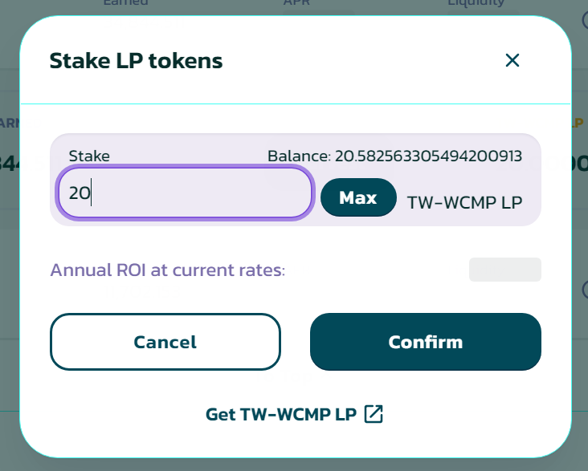
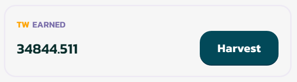
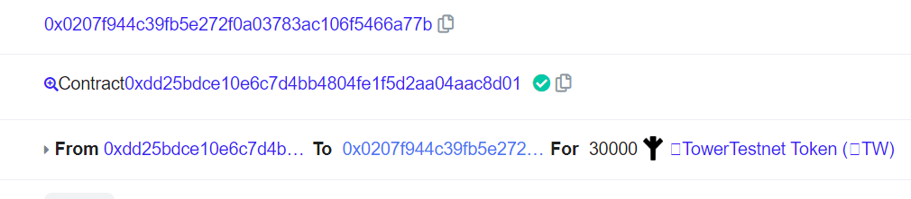

# 🍬 How to Farm

To start earning token in farming page, you must have LP tokens. you can get LP token by adding liquidity on towerswap. _<mark style="color:yellow;">follow the Liquidity document page if this firts for you.</mark>_

Go to Farm Page [<mark style="color:blue;">https://testnet.towerswap.finance/farms</mark>](https://testnet.towerswap.finance/farms)<mark style="color:blue;">.</mark> and follow the step below.

<figure><figcaption></figcaption></figure>

<figure><figcaption></figcaption></figure>

<figure><figcaption></figcaption></figure>

**Confirm & Done** :tada:

### How To Harvest (Claim reward)?

<figure><figcaption></figcaption></figure>

You just need to click <mark style="background-color:green;">**Harvest**</mark> button and confirm.&#x20;

Done :tada:

<figure><figcaption></figcaption></figure>

_<mark style="color:green;">Now your reward has been deposit to your wallet.</mark>_

Enjoy your reward :thumbsup:
