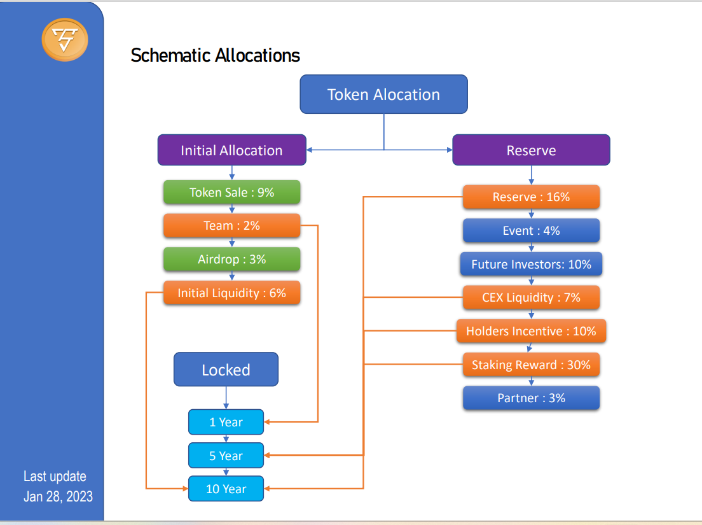
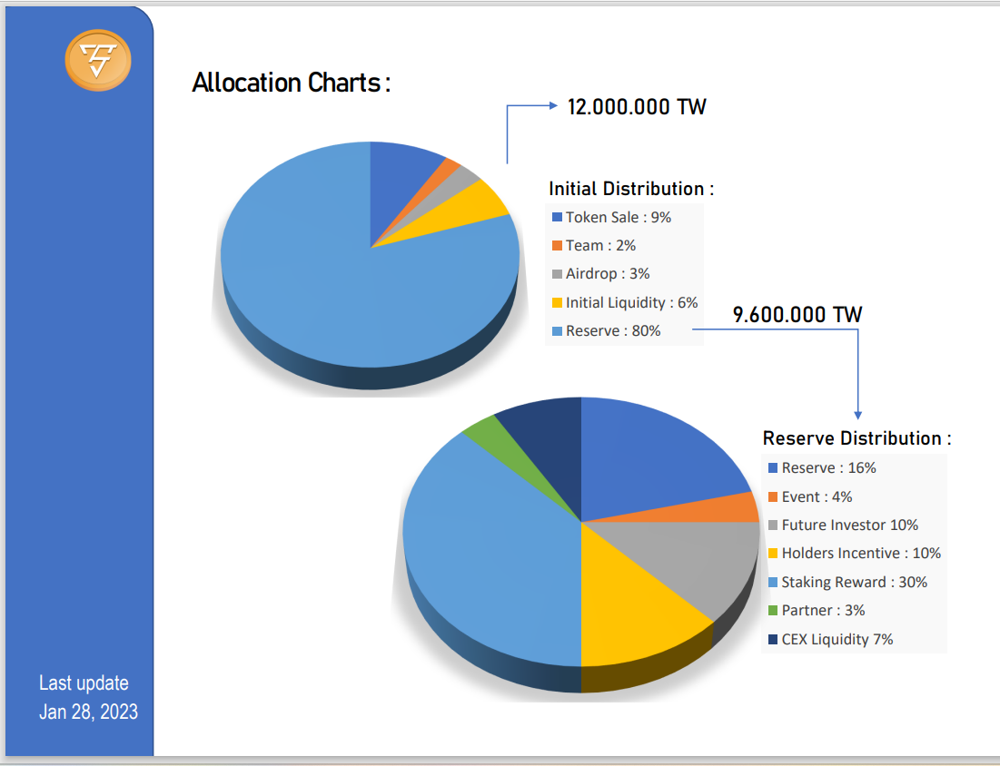

# Token Allocation Details

Token Name : TowerSwap&#x20;

Token Symbol : TW&#x20;

Decimal : 18 Max&#x20;

Supply : 12.000.000&#x20;

Initial Price : 0.5 $

## Alloction :

<mark style="color:green;">Initial Distribution :</mark>

Token Sales :  9%

Team : 2%

First Airdrop : 3%

Initial Liquidity : 6%v

<mark style="color:green;">Reserve Tokens Distribution :</mark>

Reserve : 16%

Event : 4%

Future Investor : 10%

CEX Liquidity : 7%

Holders Incentive : 10%

Staking Reward : 30%

Partner : 3%

### Schematic Allocations

<figure><figcaption></figcaption></figure>

### Allocation by Chart

<figure><figcaption></figcaption></figure>
