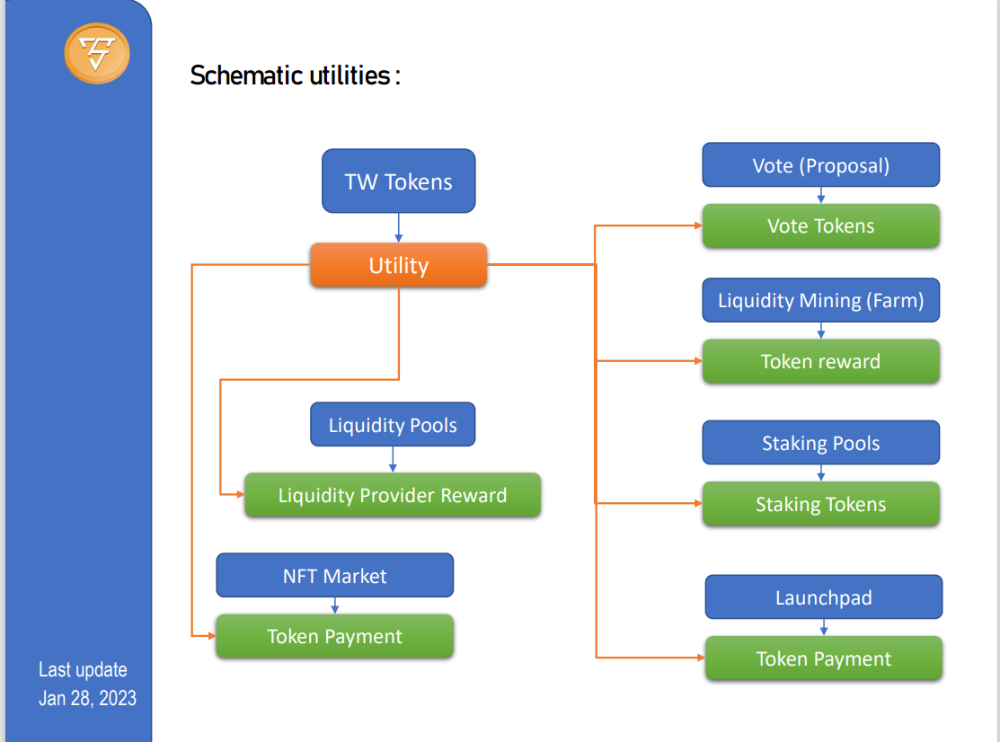

# TowerSwap Token

### What is TowerSwap Token?

Similar to Uniswap and SushiSwap, TowerSwap makes use of the AMM exchange model which relies on liquidity pools to facilitate trades.

In depositing funds to a liquidity pool, users or liquidity providers are compensated with the native token called TW (TowerSwap Token).

So, TowerSwap Token is a Native and Utility token created specifically for the operation of the TowerSwap platform.

### TowerSwap Token Use Case

Native token platforms

In the TowerSwap platform, there are two tokens that will be used as the main token, namely the CMP Token (Native Blockchain) and the TW token as the native token platform.

TW token will be used as

• Main pair of native chain tokens (CMP/TW).

• Staking and Liquidity mining rewards.

• Governance Tokens (Vote).

• More use cases will be updated as the APP progresses.

**How to get TW tokens?**

_There are several ways to get TW tokens._

By participating in token sales

By purchasing when the token has been launched on platform.

By participating in events such as Airdrop or giveaway.

### Schematic utilities&#x20;

<figure><figcaption></figcaption></figure>

