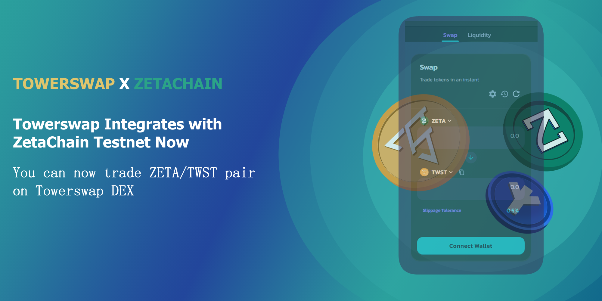
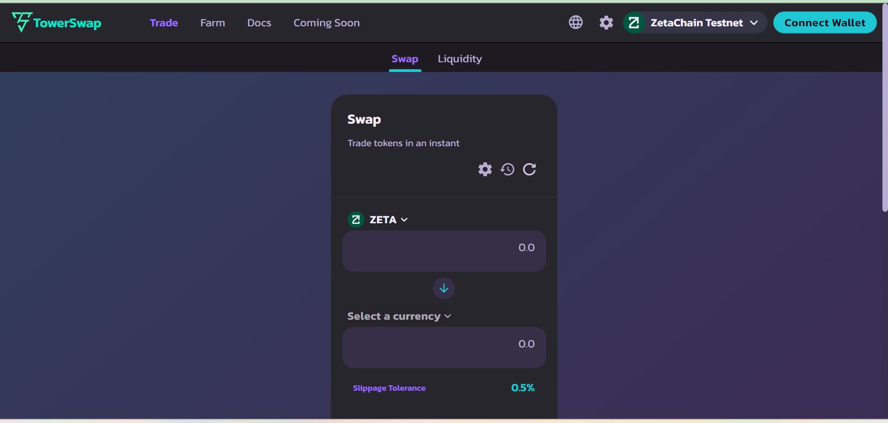
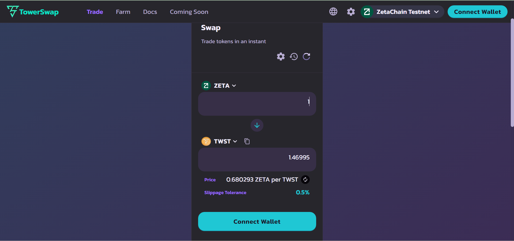

# Testnet Integration

<figure><figcaption></figcaption></figure>

**Towerswap now integrated with Zetachain testnet**

**Swap In Testnet**

Towerswap platform now support zetachain testnet by SWAP and Liquidity Pools.

You can now try to buy TWST (towerswap testnet token) with Zeta token.&#x20;

Go to https://towerswap.finance and switch the wallet to Zetachain.

<figure><figcaption></figcaption></figure>

Then, go to menu and click "Trade" and the platform will bring you to Swap page.

<figure><figcaption></figcaption></figure>

Press the "<mark style="color:green;">**Select a Currency**</mark>" and choose the "<mark style="color:yellow;">TWST</mark>" then buy.

<figure><figcaption></figcaption></figure>

Press "SWAP" and confirm to your wallet.&#x20;

**DONE** :tada:
